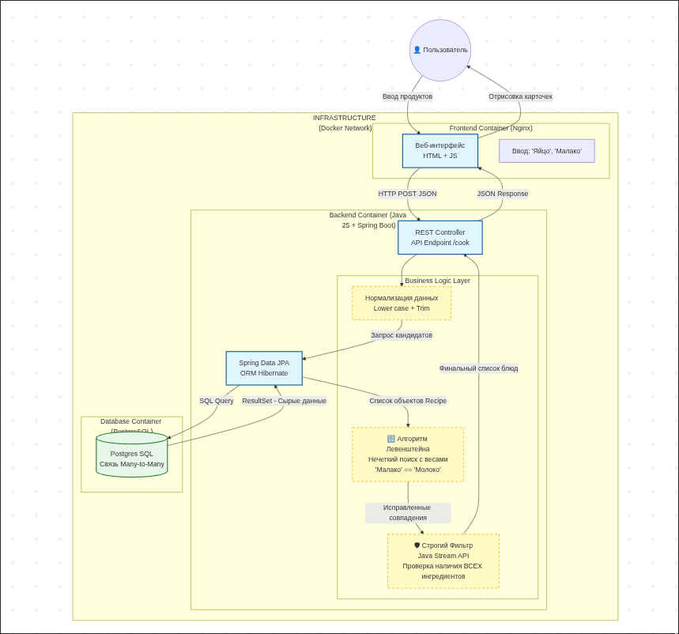

Арьес

# Описание

"FridgeRaider" — Что приготовить из того, что есть.
Суть: Вбиваешь продукты, которые есть в холодильнике (Яйца, Молоко, Помидор). Приложение выдает рецепты.



# Зачем нужны Java и докер?

О, первый вопрос я ситниковой рассказывал. Ну короче смотри:
Java is a general-purpose, object-oriented, and platform-independent language.
It's used in a wide variety of modern industries where Java is used today.
Mobile Development, which is crucial for smartphone apps. Artificial Intelligence, used in finance for risk assessment, and Big Data, where companies track massive amounts of information. The author also discusses Software Development and Mobile Blockchain. The Internet of Things, or IoT, where Java connects devices in smart homes and cities. Finally, the author highlights Web Development, where Java is used for interactive web pages.

Docker нужен для воспроизводства среды. Особенно важно, при работе в команде, когда у одного Ubuntu на WSL2.0, а у второго какой-нибудь NixOS, а у третьего MacOS.

# Почему вы захотели быть программистом?

Алгосы интересно решать было, а потом линукс (nixos + arch) запал в душу.

# Почему я ненавижу операционную оболочку Windows и все продукты мелкомягких?

Единственное, что держит людей от перехода на Unix-like OS - это проприетарный софт, адекватно адаптированный только лишь для Windows, а также банальное "работает - не трогай", ну и просто пофигизм конечно же.
Про прям все продукты мелкомягких сказать не могу, но office на мобилках это лютый **\*\***. Регаться по почте microsoft, там ещё подписка, та ну его... Лучше уже wps office пользоваться.
Последний софт от microsoft, которым я пользовалься (не считаем github) был edge 2 года назад. Я прям фанател от вертикальных табов и перформанса именно на винде. Но он меня так бесил во время лицея... Просто вылезал и на закрывался, пока не нажмёшь на "Принять соглашения".
НУ и винда с её костыльностью, реестрами, невозможностью поставить что-то кастомное на свой вкус без побочки в виде синего экрана через неделю, и тд.

# ЧЕРНОВ

Почему Чернов? <----------------------------------------
|
|
|
Он Любит: Ряженку + Опаздывать + Учить детей -> атмосфера по кайфу

# Запуск

```sh
docker compose up --build
```

Основной интерфейс: `http://localhost`
Шпионская панель: `http://localhost/spy.html`
