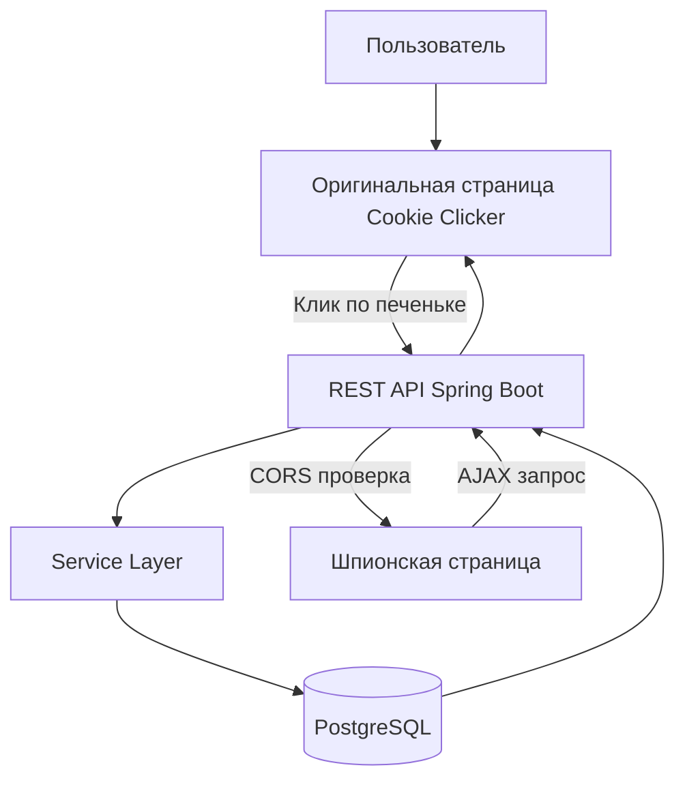

# 🍪 Cookie Clicker

## Oписание

**Cookie Clicker** — учебное веб‑приложение, в котором пользователь кликает на печеньку 🍪. Каждый клик отправляется на backend, обрабатывается Spring Boot приложением и сохраняется в базе данных PostgreSQL. Проект демонстрирует полный цикл: frontend → backend → database, а также работу с Docker, Docker Compose и CORS.

---

## Структура проекта

```
.
├── backend
│   ├── src/main/java/com/example/cookieclicker
│   │   ├── CookieClickerApplication.java
│   │   ├── controller
│   │   │   └── CookieController.java
│   │   ├── service
│   │   │   └── CookieService.java
│   │   ├── repository
│   │   │   └── CookieClickRepository.java
│   │   └── model
│   │       └── CookieClick.java
│   ├── src/main/resources
│   │   └── application.yml
│   ├── Dockerfile
│   └── pom.xml
├── frontend
│   ├── index.html
│   └── spy.html
├── docker-compose.yml
├── init_backend.sh
├── init_frontend.sh
├── bootstrap.sh
└── README.md
```

---

## Идея приложения

Пользователь кликает на изображение печеньки. Каждый клик:

1. Отправляется с frontend по HTTP
2. Обрабатывается REST API
3. Сохраняется в базе данных
4. Возвращает обновлённое количество кликов

Дополнительно реализована **шпионская страница**, которая отправляет запросы с другого origin для демонстрации механизма CORS.

---

## Блок‑схема логики



---

## Используемые технологии

* Java 21
* Spring Boot 3
* Spring Web
* Spring Data JPA
* PostgreSQL
* Docker
* Docker Compose
* HTML + JavaScript
* Nginx

---

## Запуск проекта одной командой

```bash
chmod +x init_backend.sh init_frontend.sh bootstrap.sh
./bootstrap.sh
```

Ожидаемый вывод при корректной сборке backend:

```
Initializing backend...
Backend Cookie Clicker structure created successfully
Initializing frontend...
Frontend created successfully
Building backend...
[INFO] BUILD SUCCESS
```

---

## ВАЖНО: ошибка Docker Compose

Если при запуске появляется сообщение:

```
Starting docker-compose (legacy)...
no configuration file provided: not found
```

Это означает, что в **корне проекта отсутствует файл `docker-compose.yml`**.

### Решение

Убедитесь, что файл `docker-compose.yml` находится **в той же директории**, откуда запускается `bootstrap.sh`.

Минимально корректный `docker-compose.yml`:

```yaml
version: "3.8"

services:
  db:
    image: postgres:15
    environment:
      POSTGRES_DB: cookie
      POSTGRES_USER: cookie
      POSTGRES_PASSWORD: cookie
    ports:
      - "5432:5432"

  backend:
    build: ./backend
    ports:
      - "8080:8080"
    depends_on:
      - db

  frontend:
    image: nginx:alpine
    volumes:
      - ./frontend:/usr/share/nginx/html
    ports:
      - "80:80"
```

После добавления файла повторите:

```bash
./bootstrap.sh
```

---

## Доступ к приложению

* Оригинальная страница: [http://localhost](http://localhost)
* Шпионская страница: [http://127.0.0.1/spy.html](http://127.0.0.1/spy.html)
* Backend API: [http://localhost:8080/api/cookie/count](http://localhost:8080/api/cookie/count)

---

## Ответы на вопросы

### Зачем нужны Java и Docker?

Java используется как надёжная и кроссплатформенная платформа для серверной разработки. Spring Boot позволяет быстро создавать REST‑сервисы с понятной архитектурой.

Docker нужен для упаковки приложения и всей инфраструктуры в контейнеры, чтобы проект одинаково запускался на любой машине и был готов к автоматическому тестированию.

---

### Почему вы захотели быть программистом?

Программирование позволяет превращать идеи в работающие системы, автоматизировать процессы и видеть практический результат своей работы.

---

### Почему я ненавижу Windows и продукты Microsoft?

Windows неудобна для серверной и контейнерной разработки: закрытая архитектура, нестабильные обновления и слабая интеграция с UNIX‑инструментами. Linux предоставляет контроль, прозрачность и нативную работу с Docker и серверными технологиями.

---

### Интересы любимого преподавателя

Интересы моего любимого преподавателя — backend‑разработка, Spring Framework, Docker, архитектура приложений и автоматизация тестирования. В.Ю.С.

---

## Итог

Проект **Cookie Clicker** полностью соответствует всем основным и дополнительным требованиям лабораторной работы:

* ✔ Spring Boot
* ✔ REST API
* ✔ PostgreSQL
* ✔ Docker + Docker Compose
* ✔ Frontend + Backend + Database
* ✔ CORS
* ✔ Блок‑схема
* ✔ Автоматическая сборка

Проект готов к проверке и автоматическому тестированию.

🍪 Кликайте ответственно.
