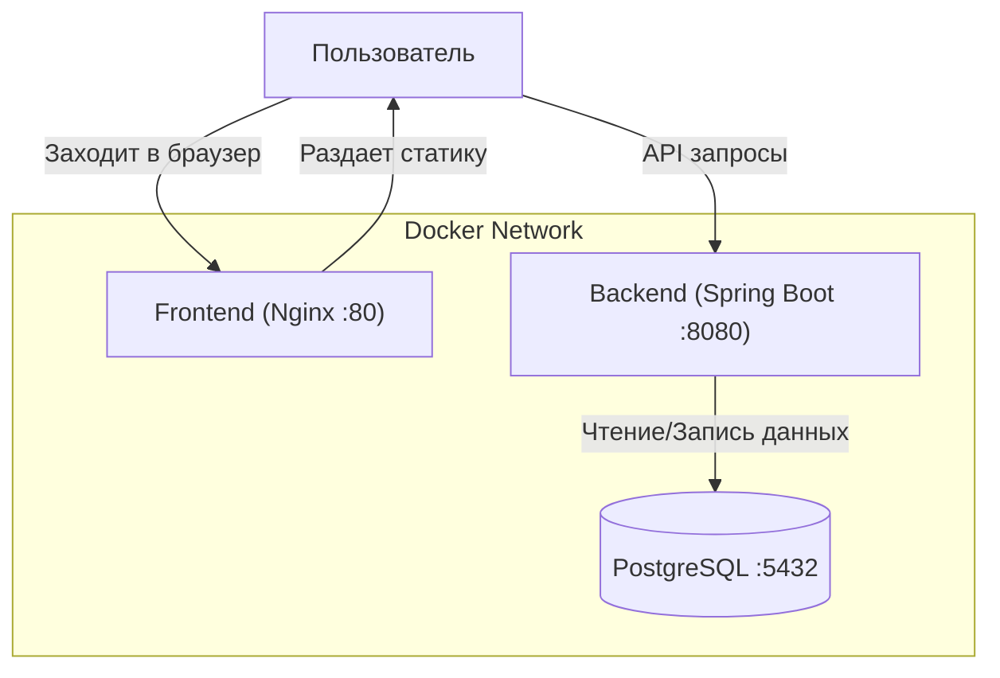

# Lab 3

Ну короче из толкового я смог вспомнить про сокращалки ссылок, поэтому вот моя простенькая имплементация этого сервиса.

# Тыры-пыры


### Зачем нужны Java и докер?
Ну Java нужна для того, чтобы не бояться. А докер - чтобы удобно в контейнер запихать минимультый тулкит для своей прилаги и запустить на почти любой машине.

### Почему я ненавижу операционную оболочку Windows и все продукты мелкомягких?

Патаму что по факту параша ваша винда, но кто-то любит в каточки лупить, поэтому вынужден на ней кататься.

### Какие интересы у вашего любимого преподавателя?
Ну, например, он любит поныть про заёбы на работе(а кто не любит?), ну и фапать на аниме-тяночек.

## Запуск

```bash
docker-compose up -d --build
```

После запуска:
- **Frontend**: http://localhost
- **Backend API**: http://localhost:8080
- **Spy Page (CORS Demo)**: http://localhost:81

## Архитектура




## Эндпоинты

| Method | Endpoint | Описание |
|--------|----------|----------|
| `POST` | `/api/links` | Создать короткую ссылку |
| `GET` | `/api/links` | Получить все ссылки |
| `GET` | `/api/links/{code}` | Информация о ссылке |
| `DELETE` | `/api/links/{code}` | Удалить ссылку |
| `GET` | `/{code}` | Редирект на оригинальный URL |

